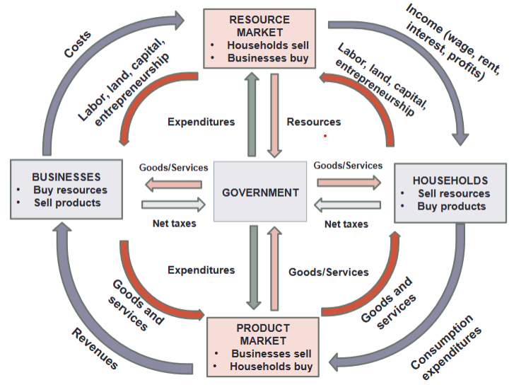

### TODO

- ACE 1A

### Absolute Advantage

- **Def'n:** Higher rate relative to other entities

### Market Economy 

- **Households:** Owners of resources which businesses need
    - Rent for land 
    - Wages for labor
    - Interest for capital
    - Profits for ent
- **Business:** Try to profit.
- **Resource Market:** Businesses buy, households sell 
- **Product Market:** Businesses sell, households buy

### Flow

- Households acquire products in exchange for income 
- Resource market gets resources from households in exchange for income 
- Business gets resources from resource market 
- Business makes revenue selling products

### Fundamental Questions

- What will be produced? 
- How will goods and services be produced?
- Who gets the output?
- How to promote progress?

### Invisible Hand 

- Free market is efficient because it maximizes utility
    - Critics say it retains inequality and market fails
- Economics is all about trade-offs    
- Market allows exchange between strangers 
    - Voluntary exchange helps both parties
- **Def'n:** Any voluntary exchange between rational beings &rarr; improve things for both parties
    - Assumes exchange is isolated
    - Free market maximizes exchanges
- "Master narrative" suggests that limitations hurt both parties
    - Imperfect information exists
- Requires three assumptions: 
    - Perfect competition: always matching price and such
        - Large companies compete with advertising
        - Competitiors come together to exploit
    - Perfect information: knowing every possible offer 
        - Extremely difficult in the future
        - Moral hazards (other party bears all risk)
    - You get what you pay for: No third party involved
        - No market for all actions, ex-dumping manure in river
        - No one wants to invest in public goods
- **Market Failure:** Flaws when an assumption is not met