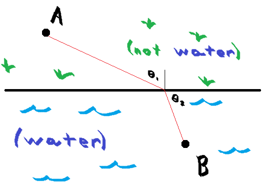

### Announcements

- He may actually create a Canvas site
- Apparently we dropped the analysis and are just a geometry class today
    - (worth noting that the hard stuff was done on paper)
- Day 4: no student has spoken in class, I think they may be figments of my imagination
- College senior sliding is *wild*

### Arbitrary Triangle Facts

1. Medians intersect at the center of mass, assuming even density
    - **Pf:** integrate along the median creating trapezoidal strips
2. Circumcenter at intersection of perpendicular bisectors
3. Incenter at intersection of angle bisectors
4. Orthocenter at intersection of altitudes

### Snell's Law

(this is now a course on optics)

**Ex:** You are at point A, ~~somewhat inland and someone is drowning~~ at point B. (~~I really should use MS paint but I can't be bothered.~~ nevermind) See the figure for details:

If you move at $v_1$ on land an $v_2$ in the water (both conveniently labeled), it's probably fair to presume that $v_1/gg v_2$. Thus, a straight line is not the fastest path. However, you happen to be able to do trigonometry on arbitrary angles in your head, so you know that $\dfrac{v_1}{v_2}=\dfrac{\sin_1{\theta}}{\sin_2{\theta}}$ will yield the optimal path. 

(talked about photons instead of doing more math, and by that I mean he talked about photons.)